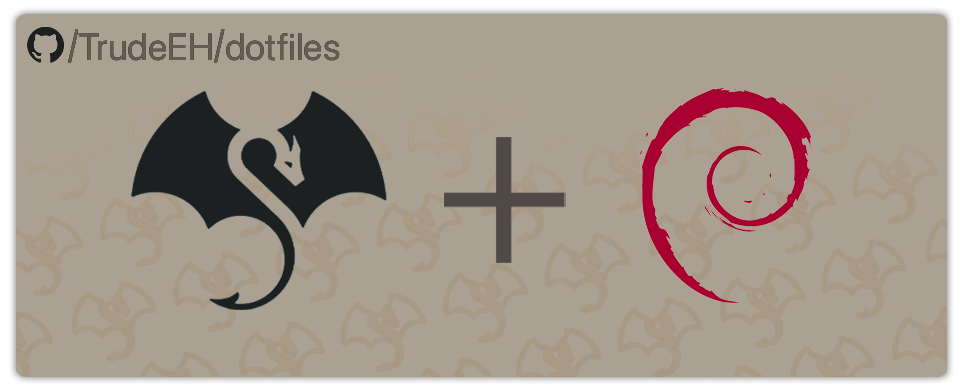
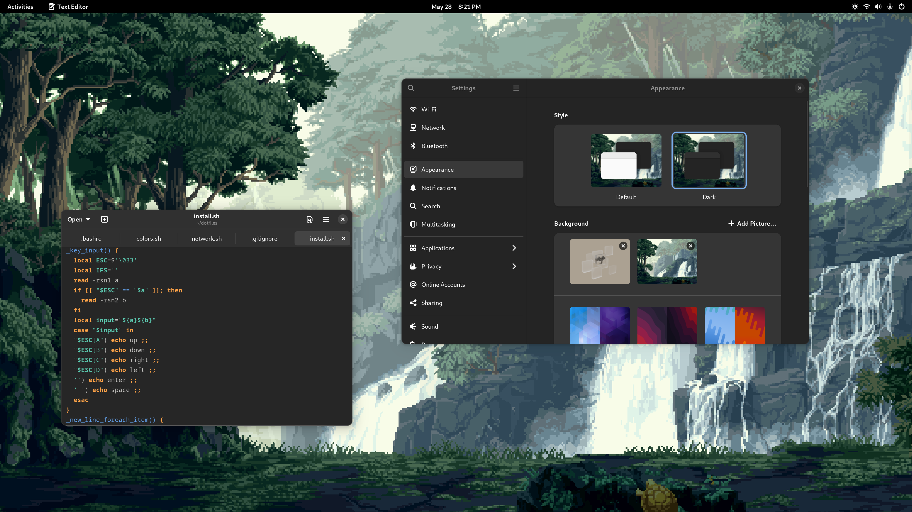

# Trude's Dotfiles



Welcome to Trude's dotfiles. Here you will find my personal configurations, tools and scripts.
Some of these only apply to the `trude` user, and assume the repository is always placed at `$HOME/dotfiles`. I highly recommend anyone interested to fork the repository and modify the configurations to your liking. 
This repo can be used as a base for you own dotfiles.

Looking for my **sway** dotfiles? [Click Here](https://github.com/TrudeEH/dotfiles/tree/arch-sway)

## Structure
- `install.sh` Install the dotfiles and set up a new Debian machine with popular applications and tools.
- `scripts/` Scripts directory. You may find some useful snippets here. These are never used as dependencies.
- `desktop-files` Some packages (mostly web and electron apps) do not run under Wayland by default. This issue causes the app to not scale properly on Wayland sessions. The desktop files here can be moved to `/usr/share/applications` to generate "4K" entries for the affected apps.

**Note:** The `settings.dconf` file is applied when the entry *Install GNOME* is selected.

## Getting Started
1. Fork the repository to be able to customize it and make it your own.

2. Run the install script by executing the code below in your terminal.
    ```sh
    git clone <your repository>
    cd dotfiles
    ./install.sh
    ```
    Alternatively, if you did not fork the original repository, run the command below.
    ```sh
    bash <(curl -L https://raw.githubusercontent.com/TrudeEH/dotfiles/main/install.sh)
    ```
3. Make it your own! Tweak the install script, change some settings and add in your own.

## Screenshots


## Tested on
- ChromeOS Crostini (Debian Container)
- Debian 12