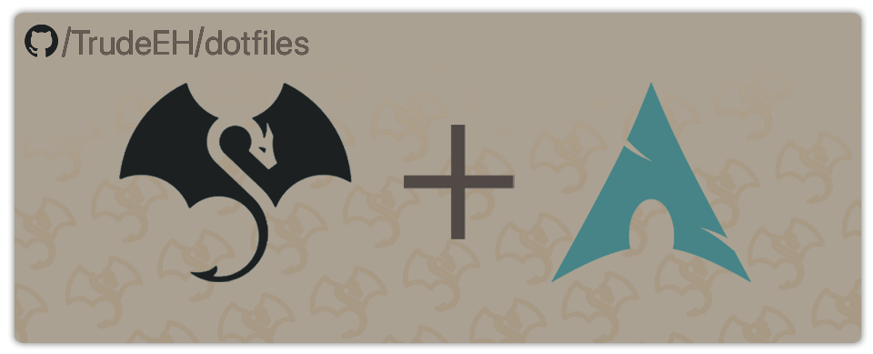
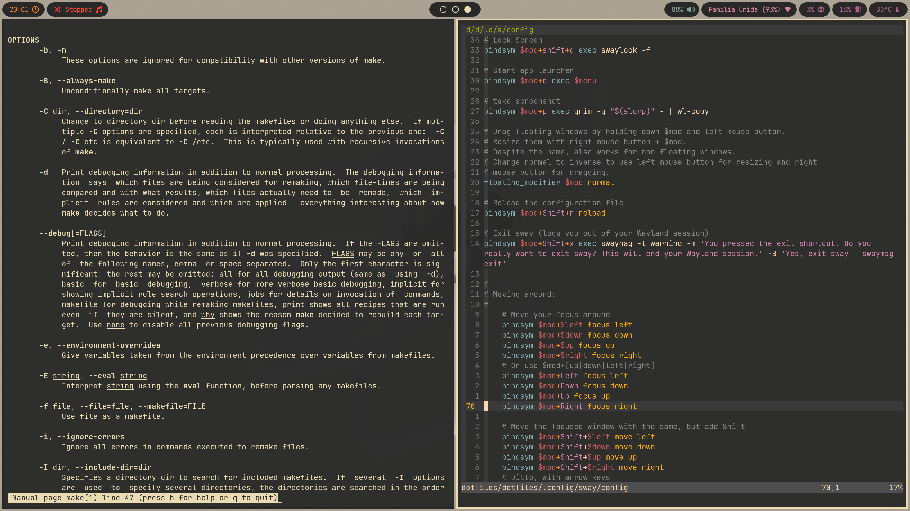
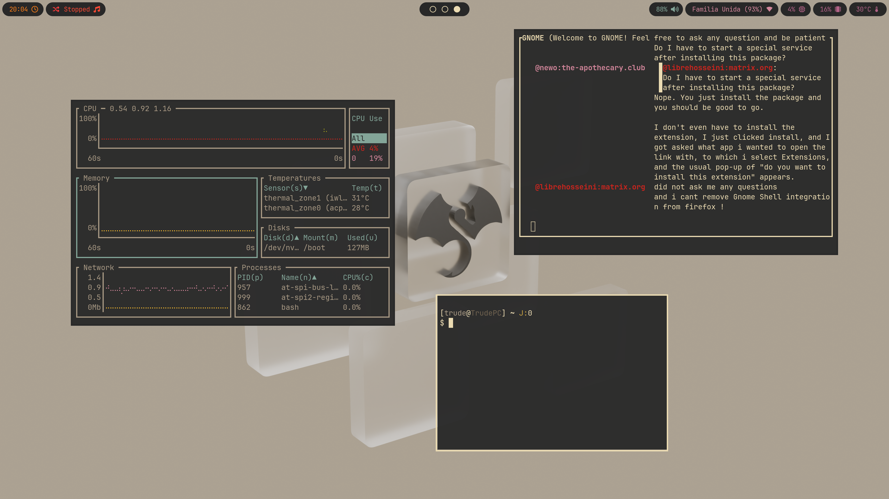

# Trude's Dotfiles



## Install
### Arch Linux
```sh
bash <(curl -L https://raw.githubusercontent.com/TrudeEH/dotfiles/main/install.sh)
```
### MacOS / Other Distros
- Replace `paru` with the correct package manager for your distro.
- Note: Some dependencies might be packaged under a different name.

## Screenshots




## Supported distros
- Arch Linux

## Tested on
- Debian Bookworm / Trixie
- Fedora Worstation 39
- Ubuntu 23.10

## Gruvbox theme used

