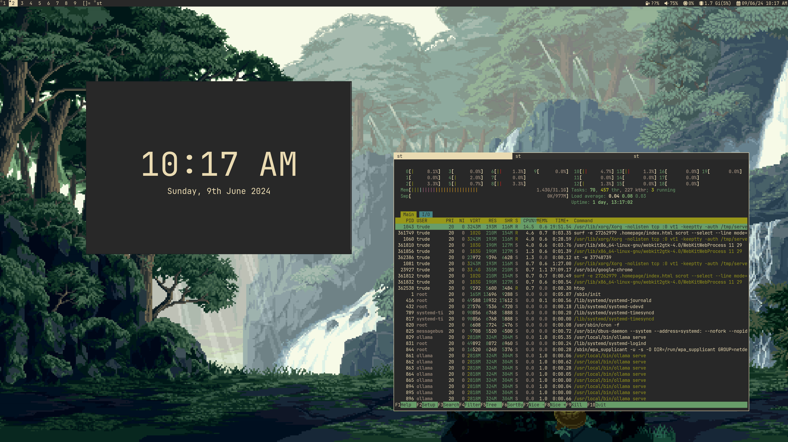
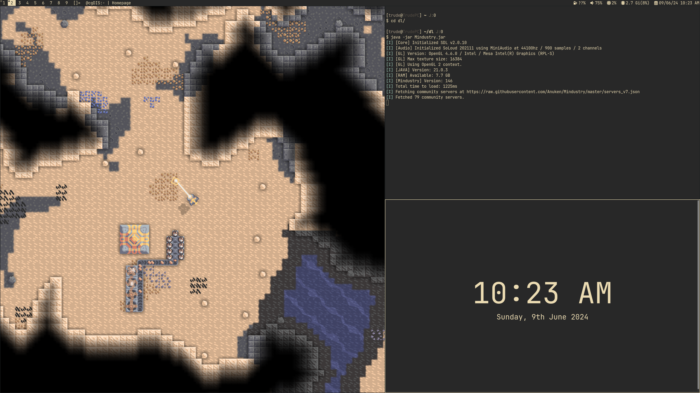

# Trude's Dotfiles


Welcome to Trude's dotfiles. Here you will find my personal configurations, tools and scripts.
Some of these only apply to the `trude` user, and assume the repository is always placed at `$HOME/dotfiles`. I highly recommend anyone interested to fork the repository and modify the configurations to your liking. 
This repo can be used as a base for your own dotfiles.

Looking for my **sway** dotfiles? [Click Here](https://github.com/TrudeEH/dotfiles/tree/arch-sway)

## Structure
- `install.sh` Install the dotfiles and set up a new Debian machine with popular applications and tools.
- `scripts/` Scripts directory. You may find some useful snippets here. These are never used as dependencies.
- `dotfiles/.local/bin` Dmenu scripts and scripts used by other programs.

## Getting Started
1. Fork the repository to be able to customize it and make it your own.

2. Run the install script by executing the code below in your terminal.
    ```sh
    git clone <your repository>
    cd dotfiles
    ./install.sh
    ```
3. Make it your own! Tweak the install script, change some settings and add in your own.

## Screenshots




## Tested on
- ChromeOS Crostini (Debian 12 Container)
- Debian 12
- Linux Mint 21.3

## Gruvbox theme

