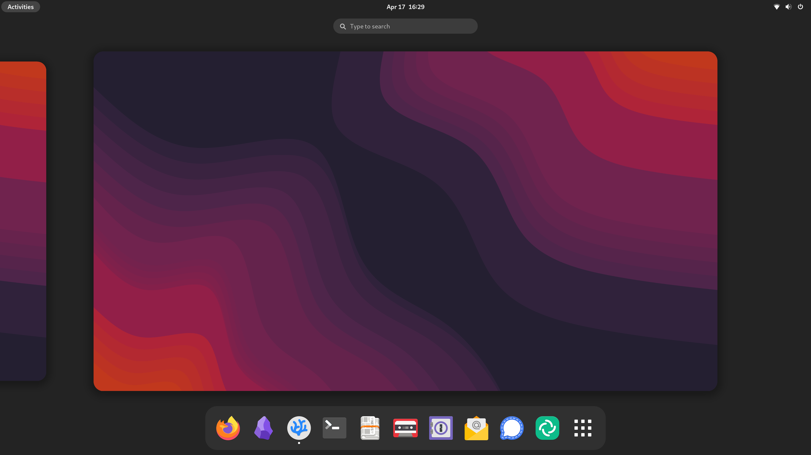

# Trude's Dotfiles

<p align="center">
  
</p>

This repository hosts my personal dotfiles.
The install script works on Linux and macOS.

The configuration is done through home-manager.
If you would like to use this repository, I recommend forking it and editing home.nix to your liking.

## Install
```sh
bash <(curl -L https://raw.githubusercontent.com/TrudeEH/dotfiles/main/install.sh)
```
## Screenshots


## Custom commands
- `extract` Extract compressed files
- `update` Update Nix and the OS.
- `reload` Rebuild the config after changing it.
- `ncs` Sync with Nextcloud

## Supported distros
- Debian
- Fedora Workstation
- Arch Linux

## Tested on
- macOS 14
- Debian Bookworm
- Fedora Worstation 39
- Ubuntu 23.10
- Arch Linux (as of last commit)
