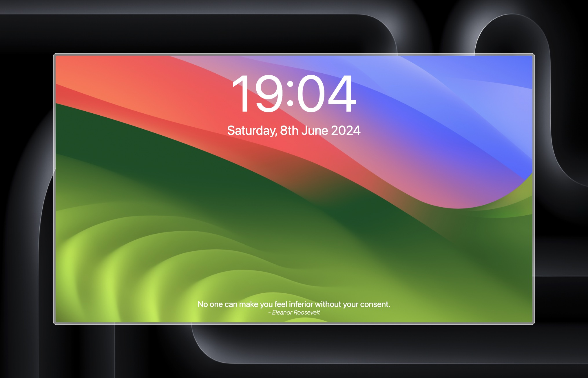
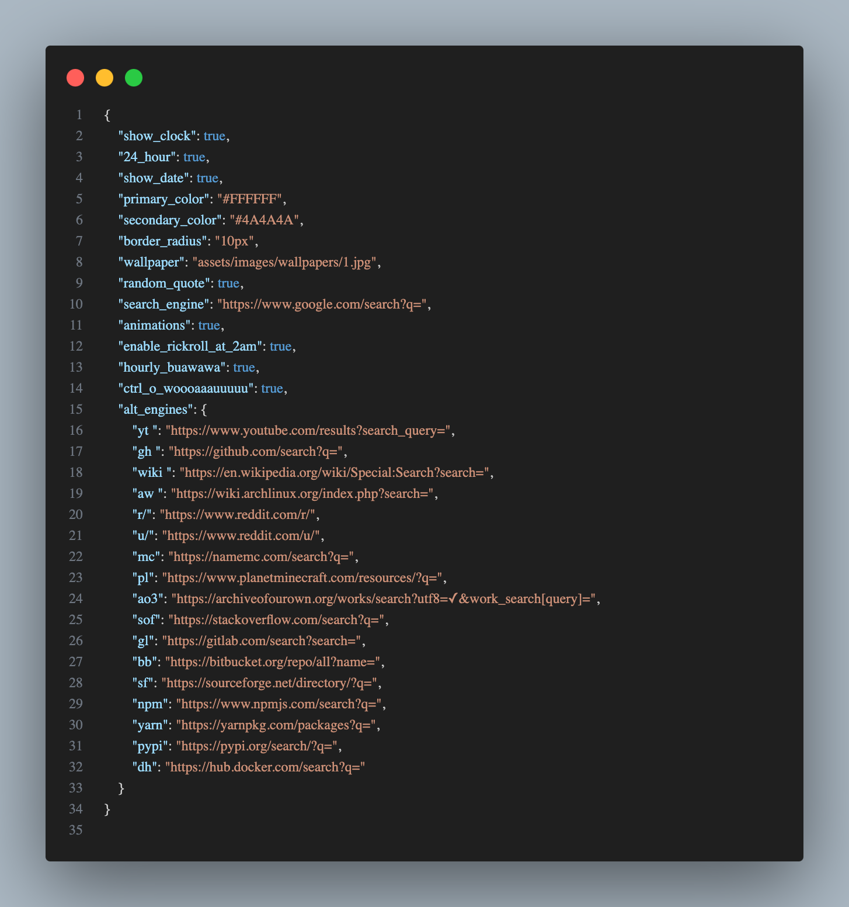

# Customizable browser homepage

This is a simple browser homepage with focus on customization.
Try is out [here](https://jcionx.github.io/homepage).

The search bar is hidden until you start typing.

The `config.json` file stores all your configs. There you can show/hide elements, change the colors, the background, the default search engine, and add aliases to more engines.

If you want to use this as your homepage directly from GitHub Pages, you can add `?config=url_to_your_config.json` to use a custom config.